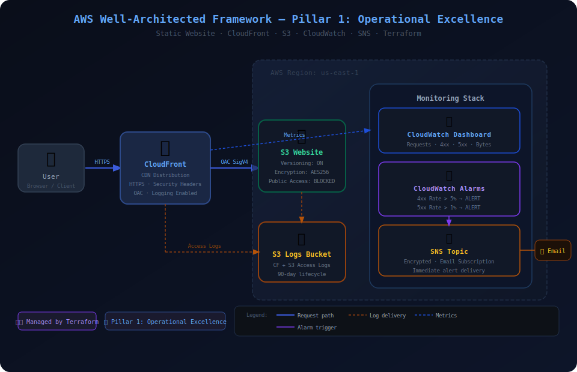

# Project 1 — Operational Excellence
## AWS Well-Architected Framework | Pillar 1



---

## Overview

This project deploys a **production-grade static website** on AWS, built entirely with Terraform and designed around the **Operational Excellence** pillar of the AWS Well-Architected Framework.

The goal is not just to host a website — it is to demonstrate how a team operates and monitors a workload in production: infrastructure as code, automated alerting, centralized logging, and a real-time observability dashboard.

---

## Architecture

| Component | Service | Purpose |
|---|---|---|
| CDN | Amazon CloudFront | Global content delivery, HTTPS enforcement, security headers |
| Origin | Amazon S3 | Static website hosting, versioning, encrypted at rest |
| Access Control | CloudFront OAC | S3 bucket is fully private — only CloudFront can read it |
| Monitoring | Amazon CloudWatch | Metrics, alarms, and live operational dashboard |
| Alerting | Amazon SNS | Email notifications when alarms fire |
| Logging | Amazon S3 (logs bucket) | CloudFront and S3 access logs with lifecycle management |
| IaC | Terraform | 100% infrastructure as code, no manual console steps |

---

## Well-Architected Alignment

### Operational Excellence Pillar — Design Principles Applied

**1. Perform operations as code**
All infrastructure is defined in Terraform. No manual console changes. Every resource is version-controlled, peer-reviewable, and repeatable across environments.

**2. Make frequent, small, reversible changes**
S3 versioning is enabled on the website bucket. Any file deployment can be rolled back to a previous version. CloudFront cache invalidation allows instant content rollbacks.

**3. Refine operations procedures frequently**
CloudWatch alarms are defined with specific thresholds that can be tuned as the workload matures. Alarm definitions live in code — not in the console — so they evolve with the system.

**4. Anticipate failure**
Three proactive alarms are deployed:
- High 4xx error rate → broken links, missing resources
- High 5xx error rate → origin failures
- Low request volume → potential DNS or availability issue

**5. Learn from all operational failures**
Access logs from both CloudFront and S3 are stored in a dedicated logging bucket with a 90-day retention lifecycle. Every request is recorded for post-incident analysis.

---

## Monitoring Stack

### CloudWatch Alarms

| Alarm | Metric | Threshold | Action |
|---|---|---|---|
| 4xx Error Rate | `4xxErrorRate` | > 5% for 2 periods | SNS → Email |
| 5xx Error Rate | `5xxErrorRate` | > 1% for 2 periods | SNS → Email |
| Low Traffic | `Requests` | < 10 req/hr for 3 periods | SNS → Email |

### CloudWatch Dashboard
A pre-built dashboard is deployed showing:
- Request count over time
- 4xx error rate trend
- 5xx error rate trend
- Bytes downloaded
- Live alarm status widget

### Access Logging
- **CloudFront logs** → `s3://logs-bucket/cloudfront-logs/`
- **S3 access logs** → `s3://logs-bucket/s3-access-logs/`
- **Retention** → 90 days (configurable via `log_retention_days` variable)

---

## Security Hardening

Even though this is the Operational Excellence pillar, security is baked in:

- S3 bucket has **all public access blocked** — only accessible via CloudFront OAC
- CloudFront enforces **HTTPS only** (`redirect-to-https`)
- TLS minimum version: **TLSv1.2_2021**
- Security response headers deployed at CDN edge:
  - `Strict-Transport-Security` (HSTS with preload)
  - `X-Frame-Options: DENY`
  - `X-Content-Type-Options: nosniff`
  - `X-XSS-Protection`
  - `Referrer-Policy: strict-origin-when-cross-origin`
- SNS topic encrypted with AWS managed key
- S3 buckets encrypted with AES-256

---

## Project Structure

```
project-1-operational-excellence/
├── providers.tf          # AWS provider + backend config
├── variables.tf          # All input variables with validation
├── s3.tf                 # Website bucket + logs bucket
├── cloudfront.tf         # CDN distribution + OAC + security headers
├── monitoring.tf         # CloudWatch alarms + dashboard + SNS
├── outputs.tf            # CloudFront URL, dashboard link, etc.
├── terraform.tfvars.example  # Template for your variables
├── .gitignore            # Excludes state files and tfvars
├── diagram.svg           # Architecture diagram
├── website/
│   ├── index.html        # Main website page
│   └── error.html        # Custom 404 page
└── README.md             # This file
```

---

## Prerequisites

- [Terraform](https://developer.hashicorp.com/terraform/install) >= 1.5.0
- [AWS CLI](https://aws.amazon.com/cli/) configured with a profile
- An AWS account with permissions for: S3, CloudFront, CloudWatch, SNS, IAM

---

## Deployment

```bash
# 1. Clone the repo
git clone https://github.com/YOUR_USERNAME/aws-well-architected-projects
cd project-1-operational-excellence

# 2. Set your variables
cp terraform.tfvars.example terraform.tfvars
# Edit terraform.tfvars with your email and preferences

# 3. Initialize Terraform
terraform init

# 4. Preview what will be built
terraform plan

# 5. Deploy
terraform apply

# 6. Visit your site
# The CloudFront URL is printed in the outputs after apply
```

> **Note:** After `terraform apply`, you will receive an SNS subscription confirmation email. Click the confirmation link to activate alerts.

> **Note:** CloudFront distributions take 5–15 minutes to deploy globally after `terraform apply` completes.

---

## Outputs

After deployment, Terraform prints:

| Output | Description |
|---|---|
| `cloudfront_domain_name` | Your website URL |
| `cloudwatch_dashboard_url` | Direct link to your monitoring dashboard |
| `website_bucket_name` | S3 bucket name |
| `access_logs_bucket` | Logging bucket name |
| `sns_topic_arn` | ARN of the alerts topic |

---

## Cleanup

```bash
# Destroy all resources (avoids ongoing costs)
terraform destroy
```

---

## Cost Estimate

This architecture is designed to be extremely low cost. For a personal project or portfolio demo:

| Service | Est. Monthly Cost |
|---|---|
| S3 (website + logs) | < $0.05 |
| CloudFront (low traffic) | < $1.00 |
| CloudWatch (alarms + dashboard) | < $1.00 |
| SNS | < $0.01 |
| **Total** | **~$2/month** |

---

## Author

Built as a portfolio project demonstrating the **AWS Well-Architected Framework — Operational Excellence Pillar**.

Technologies: `Terraform` `AWS S3` `Amazon CloudFront` `Amazon CloudWatch` `Amazon SNS`
